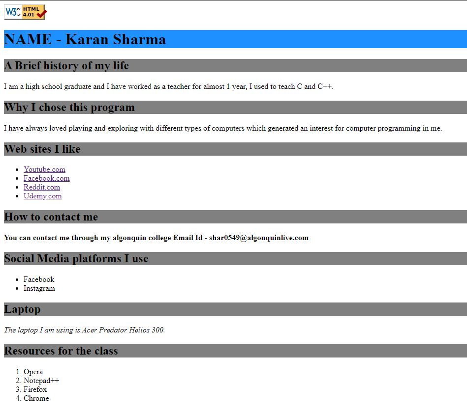
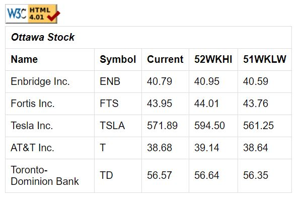
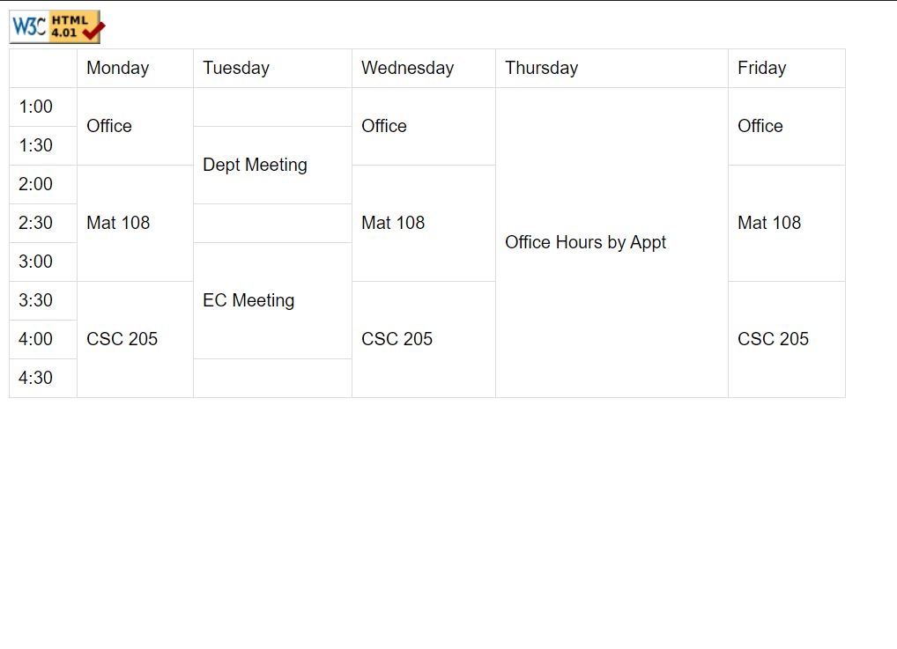

# Web Development (School assignments | HTML-CSS-JavaScript-PHP)

Lab 2 - A simple HTML page with some inline CSS styling. This page consists some basic information about me. Built using hyperlinks, CSS styling, strong style text, headings, ordered list and unordered list.

Lab3 - Task1 -> A HTML page with internal CSS styling. This page is built up using tables.

       Task2 -> Same as Task 1 but with a different table. 

Lab 4 - 
