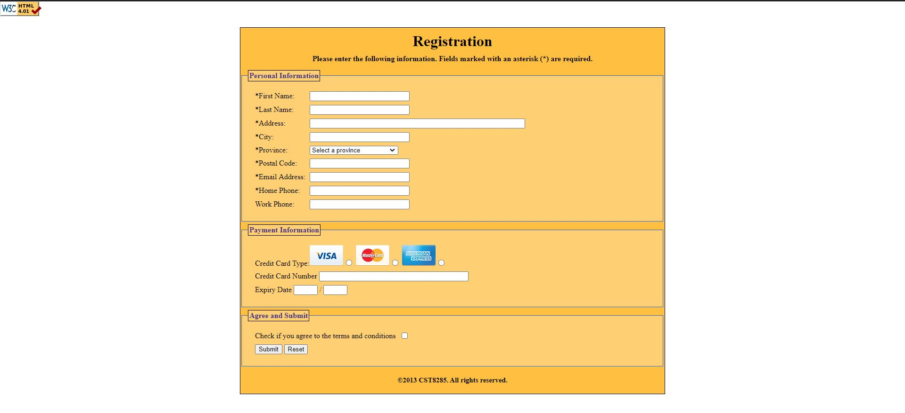
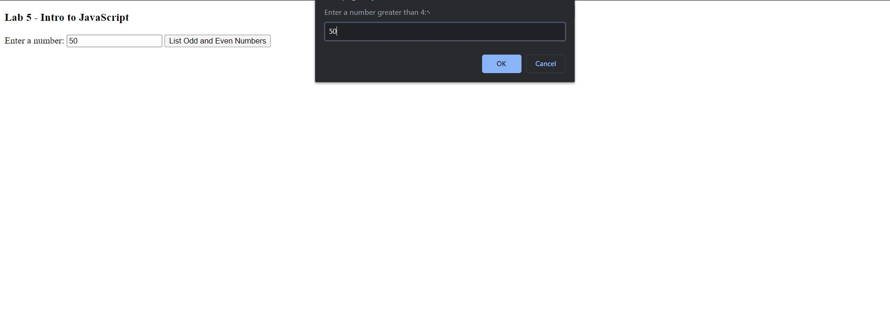
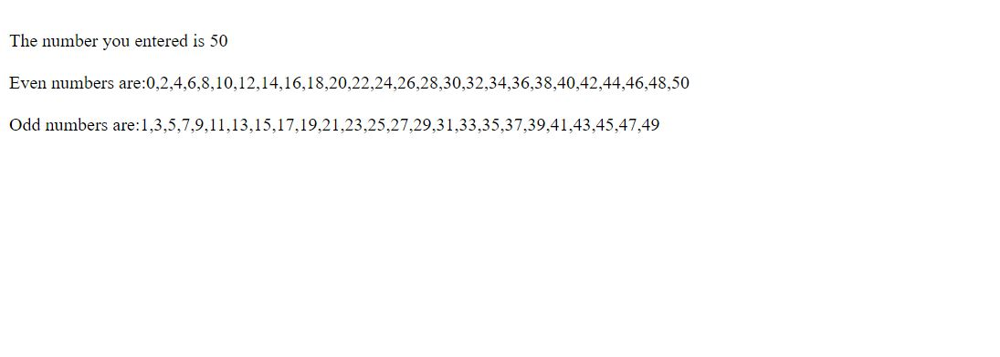
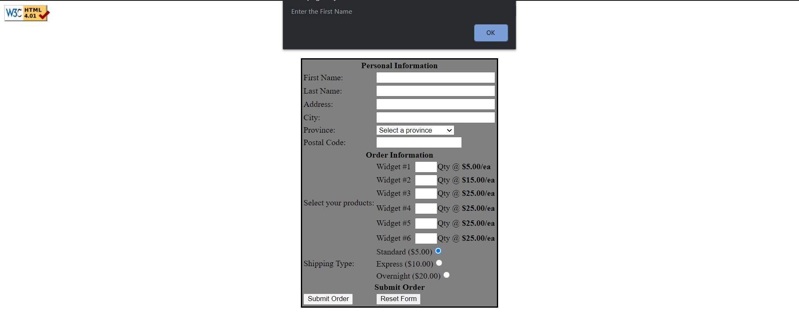
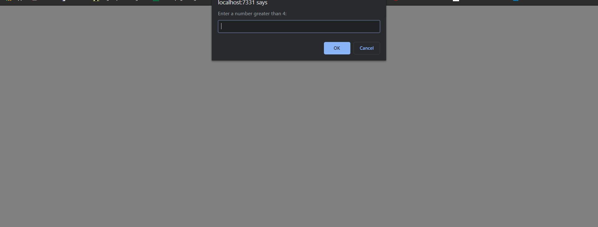
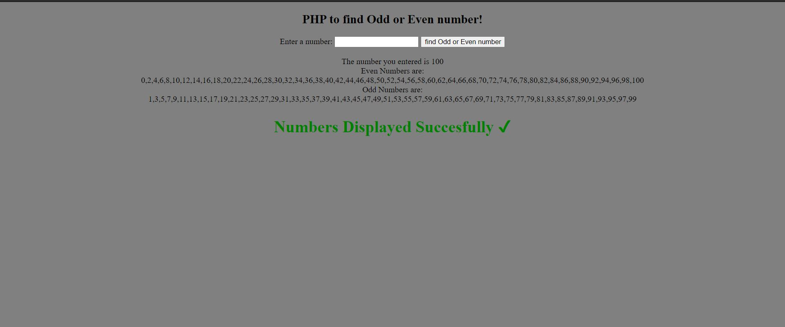

# Web Development (School assignments | HTML-CSS-JavaScript-PHP)

Lab 2 - A simple HTML page with some inline CSS styling. This page consists some basic information about me. Built using hyperlinks, CSS styling, strong style text, headings, ordered list and unordered list.

Lab3 - Task1 -> A HTML page with internal CSS styling. This page is built up using tables.

       Task2 -> Same as Task 1 but with a different table. 

Lab 4 - Built using HTML (Basic HTML + forms).

Lab 5 - Built using HTML and JavaScript. An even and odd number seperator. Uses prompt dialog for user to enter the number, seperates the evens and odds between 0 to the number           entered by the user and displays them on the page.

Lab 6 - Built using HTML, CSS and JavaScript. Same as Lab 4 with different design and it includes alert dialogs to show an alert if any information in the form is missing.

Lab 7 - Built using HTML, JavaScript and PHP. Same as Lab 5 with different design and it includes alert dialog to show an alert if a user enters a number less than 4 or greater           than 100.

